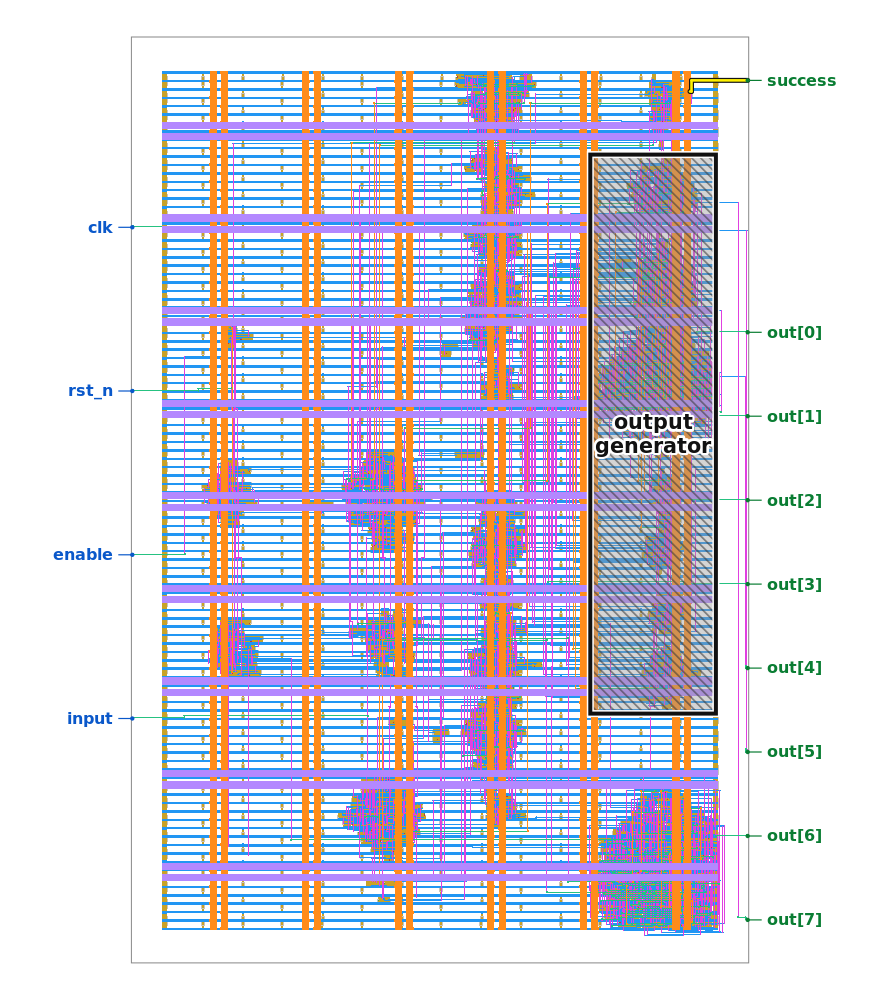
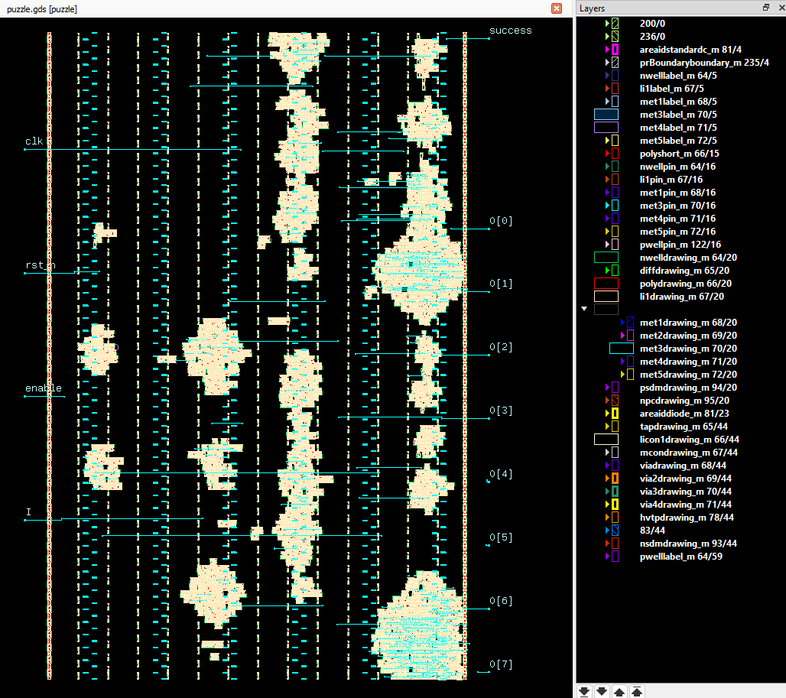
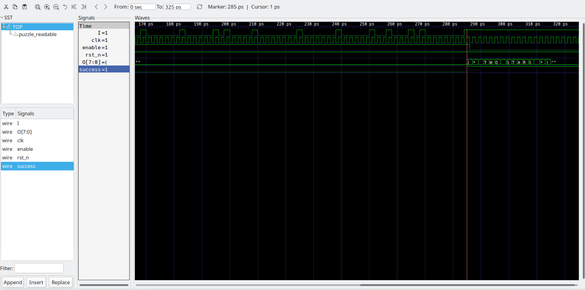

# Chasing `success`: Jane Street ASIC Reverse-Engineering Challenge
This is our attempt at cracking the [Jane Street ASIC Reverse-Engineering Challenge](https://blog.janestreet.com/can-you-reverse-engineer-an-asic/): Reverse engineering an ASIC from its raw GDSII layout!


| Top level chip-layout | A closer look of core sub-units|
|-|-|
|||

We found the solution with the following broad steps (more details being added soon!):
- Converting the GDS into a SPICE Netlist (essentially LVS extraction with magic)
- Parsing the SPICE --> verilog (a parser built with python)
- Testing our parsed Verilog (Verilator + GTWave)
- Mapping out the logic that drives `success`
    - The entire logic for evaluating `success` runs periodically every 122 clock cycles - so that hints that the winning `I` must be 122 bits long (rules out any brute-forcing)
    - Compiling a CNF expression for `success`. The observation about the 122-cycle length evaluation window bounds the depth of the CNF to 122.
        - (CNF: Conjunctive Normal Form, a canonical way of listing complex boolean expressions in product-of-sum clauses)
- Running a SAT solver (we used `minisat`) to examine satisfiability of the `success` flag

NOTE: Although the solution here relies on a SAT solver, we are interested mapping out the full chip (See [Open Threads and Future Work](#open-threads-and-future-work))

# Winning Sequence
Winning sequnce we found for `I` that makes `success`=1 is is 122 bits long:
```
00000001010100001000000000000101010100000000000010100000010000010000001000001010000100000001000000100000100100010100000001
```
- The chip also puts out the following output message on the `O` pins: `(* TWO STARS *)`



# Easter Eggs
| Input  `I`  | Message in output `O` |
| ----------- | --------------------- |
| All 0's     | `BIG BANG`            |
| All 1s      | `EMPTY SKY`           |
| Most inputs | `TRY AGAIN`           |

# Open Threads and Future Work
Here are some WIP threads that we're continuing on:
- Decoding the entire FSM
- Understanding the exact hashing algorithm running inside
    - (This chip is very likely implementing a [sponge function](https://en.wikipedia.org/wiki/Sponge_function), based on the 11-cycle internal periods we've seen. There are also other signal families showing periods of 8,16,and 44)
- Working out how exactly the hash of the passphrase is encoded into the netlist (and not hardcoded with tie-up/down cells)
- Are there multiple solutions to `I`? (SAT doesnt guarantee uniqueness)

# TODO:
Need to add more extensive debbugging notes (work in progress)
- tag/label the clock domains seen in the KLyaout screenshot based on their funcitons
- Add notes about the period hunting (+screenshots)
    - This gave insight into he nature of the hash function being used inside
- Show how the `success` logic is gated to evaluate every 122 cycles
    - This is clear from the behavior of `~or2_2_11_B & or2_2_11_A`

